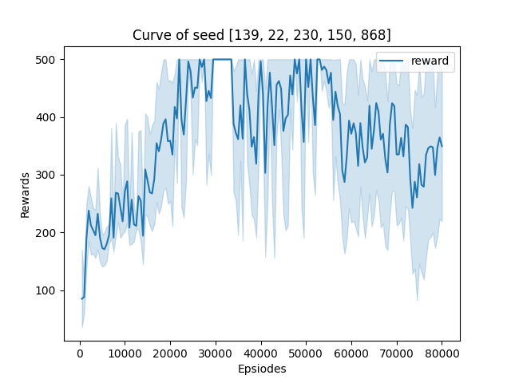

该部分使用`gym`库中的环境[`CartPole-v1`](https://www.gymlibrary.dev/environments/classic_control/cart_pole/)实践DQN算法，以下仅为笔者个人的实验报告。这里实现的是最基本的DQN。

## 文件结构

> .  
> ├── dqn.py  
> ├── main.py  
> ├── output  
> │   ├── models  
> │   └── results  
> ├── plot.py  
> ├── train.py  
> └── utils.py

+ `results`文件夹：训练过程数据，以`.pkl`储存；训练曲线图片
+ `models`文件夹：储存模型
+ `dqn.py`：根据DQN算法定义的智能体类
+ `train.py`：train和test流程，上层的训练模式
+ `main.py`：超参数设置，调用整体训练流程
+ `plot.py`：绘图相关功能，可以单独运行利用数据绘图
+ `utils.py`：数据记录、文件夹创建等杂项功能

## 实验结果

以默认超参数训练8e4个step，得到训练曲线如下：

