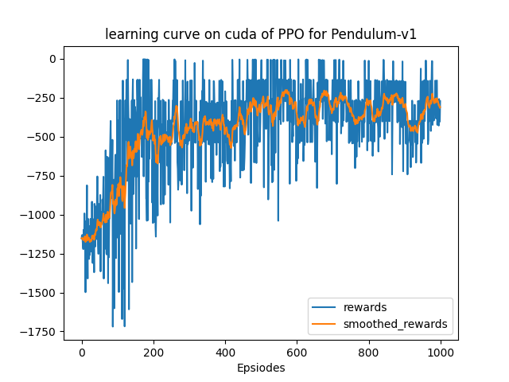
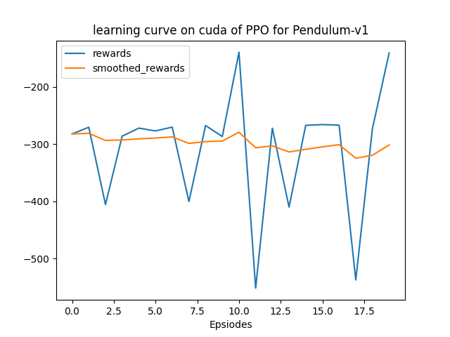

该部分使用`gym`库中的环境[`Pendulum-v1`](https://www.gymlibrary.dev/environments/classic_control/pendulum/)实践PPO算法（这里实现的是PPO-clip），以下仅为笔者个人的实验报告。这里实现的PPO支持连续动作。

## 文件结构

> .  
> ├── main.py  
> ├── output  
> │   ├── models  
> │   └── results  
> ├── README.md  
> ├── ppo_continuous.py  
> └── solver.py  

+ `results`文件夹：为程序的输出结果，包括：在不同训练episode数下，训练及测试的reward曲线，以及挑选一次test录制的可视化的动作。
+ `models`文件夹：储存模型
+ `ppo.py`：根据PPO算法定义的agent类，ActorCritic模式
+ `solver.py`：train和test流程，即上层的训练模式

## 实验结果

以超参数：

```python
'ep_max_steps': 100000,
'actor_lr': 3e-4,
'critic_lr': 3e-4,
'coef_entropy': 0.01,
'entropy_decay': 0.999,
'clip_eps': 0.2,
'gamma': 0.9,
'gae_lambda': 0.9,
'steps_per_batch': 512,
'run_epochs': 10,
'batch_size': 64,
'hidden_dim': 64,
```

训练1000个episode，得到训练曲线如下：



test结果如下：




几个问题记录如下：

一是这种train和test的写法不是太好，test结果受训练曲线浮动影响，不太有代表性，往后会更改一下。另外也把横轴从episode改称step。

二是学习率测试下来只有0.9能比较稳定的收敛到比较好的结果，0.99大概率学不出来，不知道是不是程序问题。

三是actor输出的mean用tanh压缩有比较好的效果，用sigmoid曲线就完全不动，暂未清楚原因。
