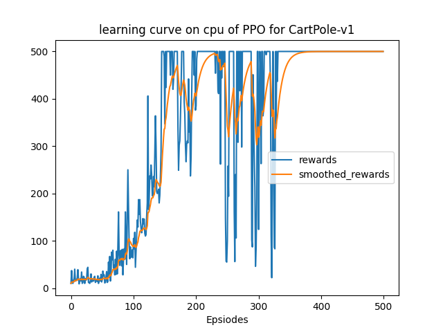
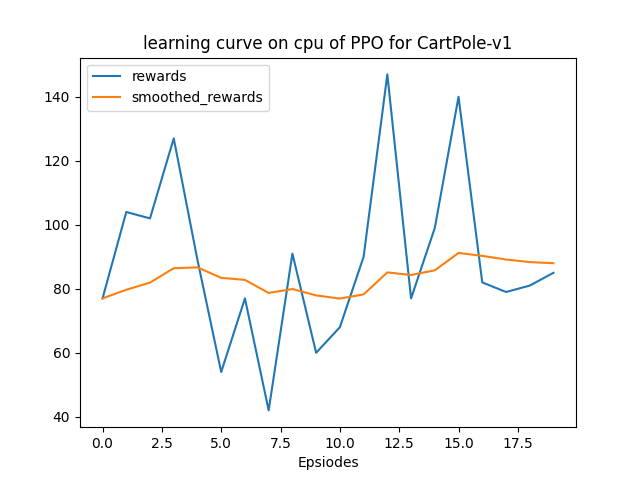
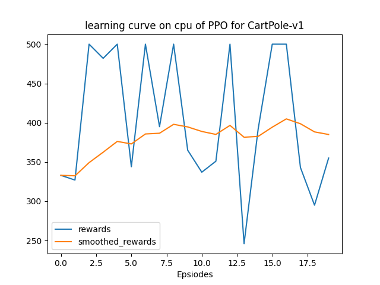
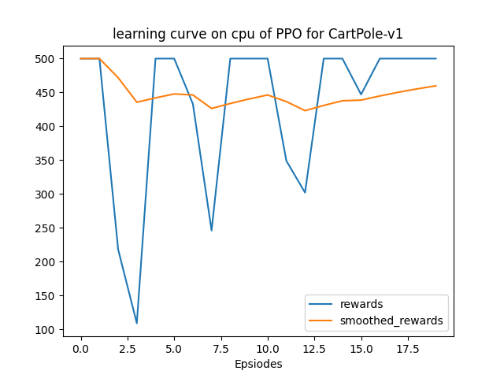
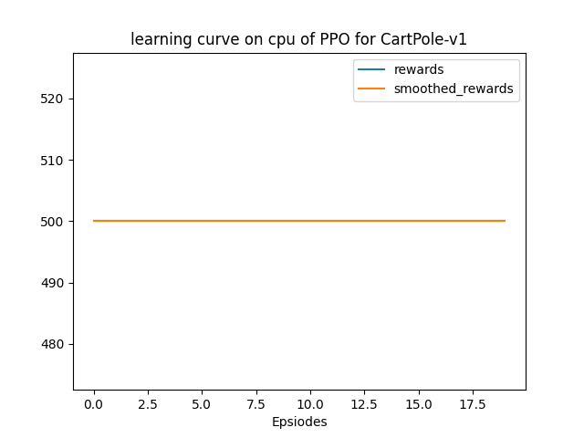
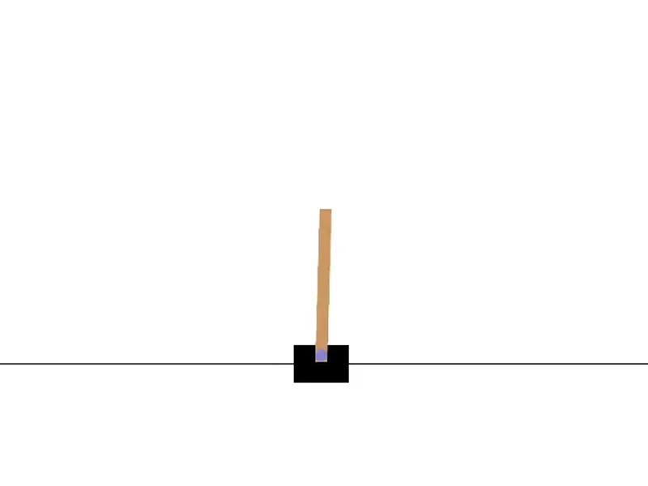
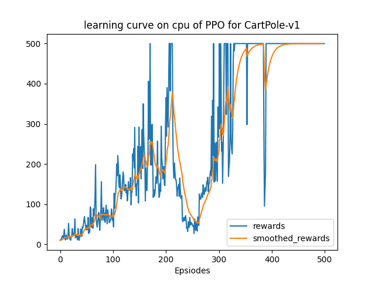
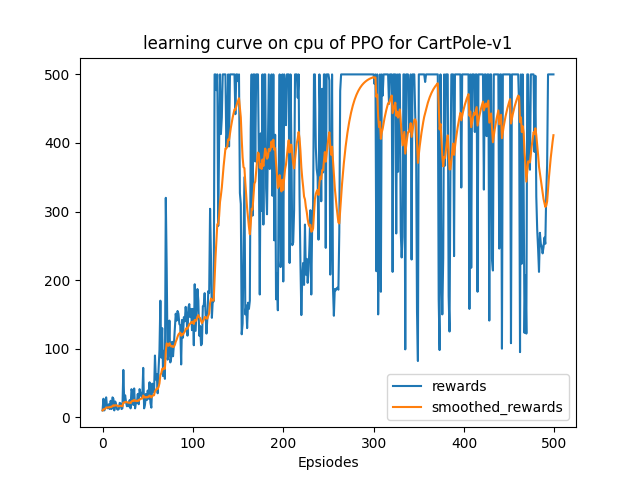

该部分使用`gym`库中的环境[`CartPole-v1`](https://www.gymlibrary.dev/environments/classic_control/cart_pole/)实践PPO算法（这里实现的是PPO-clip），以下仅为笔者个人的实验报告。这里实现的PPO仅支持离散动作，连续动作请参见PPO-continuous。

## 文件结构

> .  
> ├── main.py  
> ├── output  
> │   ├── models  
> │   └── results  
> ├── README.md  
> ├── ppo.py  
> └── solver.py  

+ `results`文件夹：为程序的输出结果，包括：在不同训练episode数下，训练及测试的reward曲线，以及挑选一次test录制的可视化的动作。
+ `models`文件夹：储存模型
+ `ppo.py`：根据PPO算法定义的agent类，ActorCritic模式
+ `solver.py`：train和test流程，即上层的训练模式

## 实验结果

以超参数：

```python
'ep_max_steps': 100000,
'actor_lr': 0.0005,
'critic_lr': 0.001,
'coef_entropy': 0.001,
'clip_eps': 0.2,
'gamma': 0.99,
'gae_lambda': 0.95,
'steps_per_batch': 100,
'run_epochs': 5,
'batch_size': 50,
'hidden_dim': 256,
```

训练500个episode，得到训练曲线如下：



每100步的test结果如下：

100个episode：



200个episode：



300个episode：



400个episode：



500个episode：


最后展示一下可视化结果：



只有500个episode就达到这种效果，可见PPO还是比较强力的。

## 进一步实验

PPO的[原始论文](https://arxiv.org/abs/1707.06347)中提到

> This objective can further be augmented by adding an entropy bonus to ensure sufficient exploratio

为了验证这一说法，令`coef_entropy`参数分别为`0, 0.1, 0.001`进行实验，结果如下：

coef_entropy=0.0:



coef_entropy=0.001:


coef_entropy=0.1:



可以看到，增大`coef_entropy`参数，也就是增大“entropy bonus”可能会导致加剧曲线的抖动，但是加上“entropy bonus”似乎确实对收敛有帮助。

当然，笔者这里的实验比较粗浅，环境也比较简单，还远不够严谨地说明效果。
