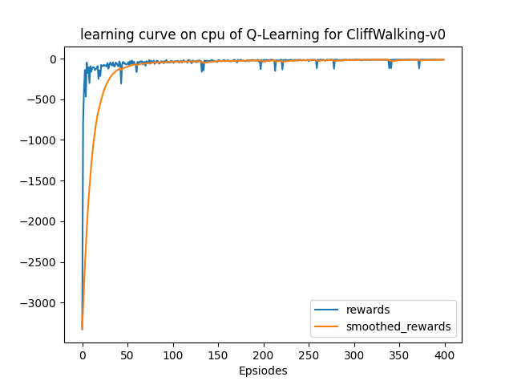
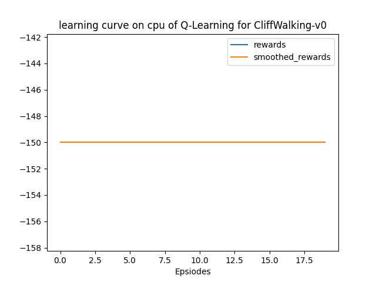
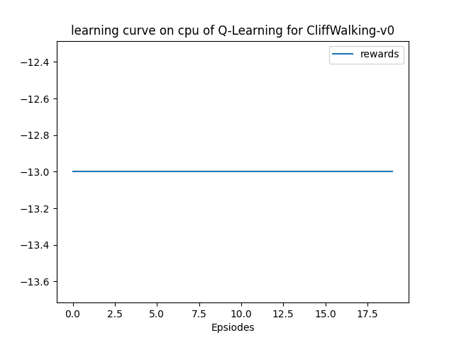
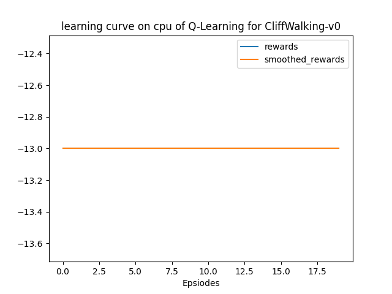

该部分使用`gym`库中的环境[`CliffWalking-v0`](https://www.gymlibrary.dev/environments/toy_text/cliff_walking/)实践RL中的基础算法Q-Learning，以下仅为笔者个人的实验报告。

## 文件结构

> .  
> ├── main.py  
> ├── output  
> │   ├── models  
> │   └── results  
> ├── qlearning.py  
> ├── README.md  
> └── solver.py  

+ `results`文件夹：为程序的输出结果，包括：在不同训练episode数下，训练及测试的reward曲线，以及挑选一次test录制的可视化的动作。
+ `models`文件夹：储存模型
+ `qlearning.py`：根据Q-Learning算法定义的agent类
+ `solver.py`：train和test流程，即上层的训练模式

## 实验结果

以超参数：

```python
'lr': 0.1,
'gamma': 0.9,
'epsilon_beg': 0.95,
'epsilon_end': 0.01,
'epsilon_decay': 300,
```

共训练400个episodes，并在每100个episode进行测试，在测试时设定最大步数为150，防止未收敛的模型导致死循环（也就是说-150的reward代表死循环）。

先给出总的训练曲线：



然后看看每个阶段的测试表现：

**100个episodes：**



测试时的表现：[可视化视频](https://raw.githubusercontent.com/Stillwtm/RL-Learning/master/Q-Learning/output/results/cliff-walking-100-episode-0.mp4)

可以看出，只训练50个episodes的模型还没有学会走路，它直接就开始面壁了。

**200个episodes：**


测试时的表现：[可视化视频](https://raw.githubusercontent.com/Stillwtm/RL-Learning/master/Q-Learning/output/results/cliff-walking-200-episode-0.mp4)

这次有了一些进步，但是小人走到上面开始面壁了。

**300个episodes：**



测试时的表现：[可视化视频](https://raw.githubusercontent.com/Stillwtm/RL-Learning/master/Q-Learning/output/results/cliff-walking-300-episode-0.mp4)

令人惊喜的是这次他能够通关了！

**400个episodes：**


测试时的表现：[可视化视频](https://raw.githubusercontent.com/Stillwtm/RL-Learning/master/Q-Learning/output/results/cliff-walking-400-episode-0.mp4)

仍然是最优路径，进一步确认模型确实基本收敛了。

## 再次实验

后来发现，似乎将学习率设定为`lr=0.9`，似乎收敛得更快🤔

可以看到一开始训练曲线的上升明显更陡峭：

并且只要50个episode小人就可以学到最优路径：



笔者怀疑是因为这个环境太简单了，所以学习率可以调到很大🤔
