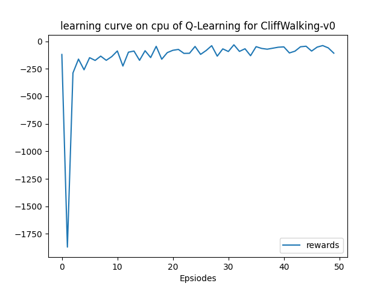
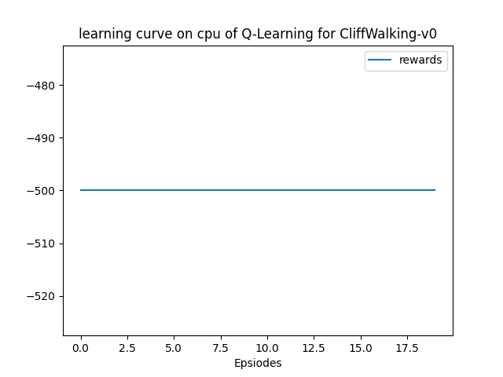
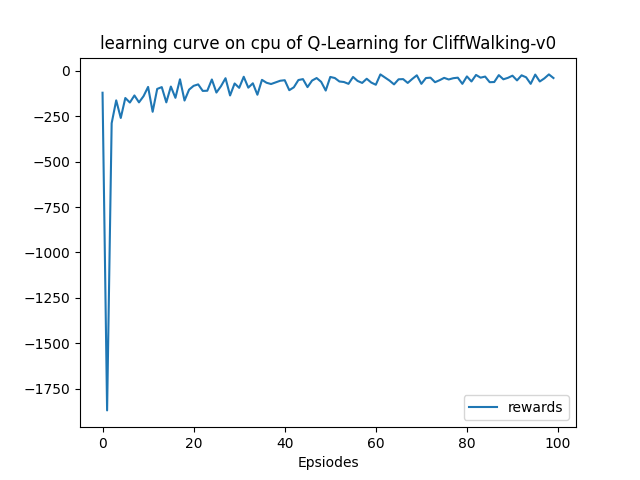
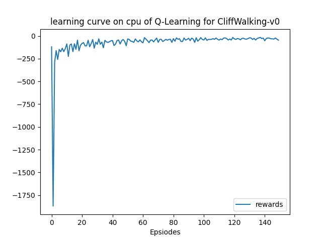
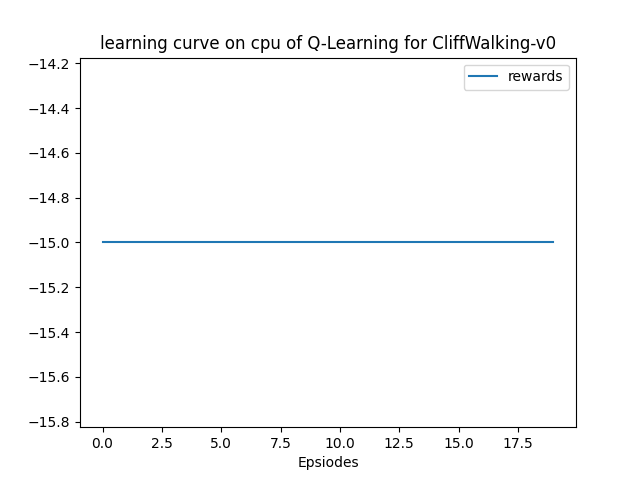
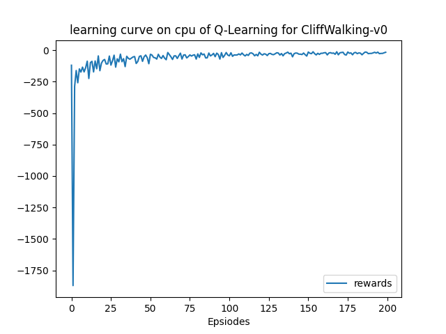
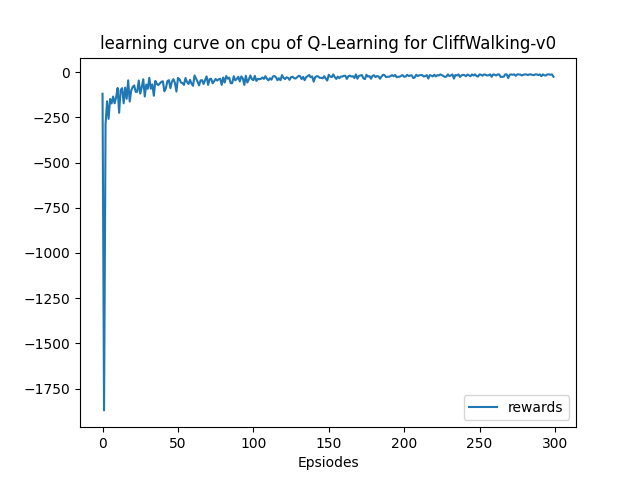
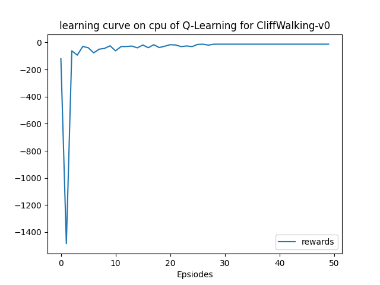
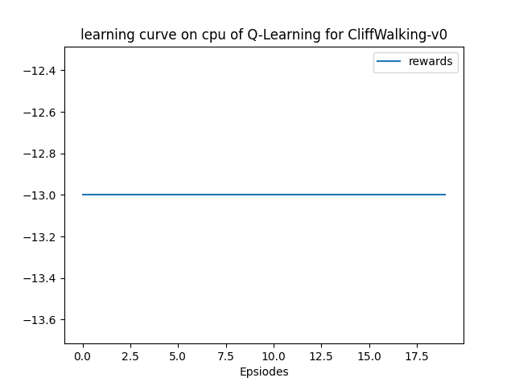

该部分使用`gym`库中的环境[`CliffWalking-v0`](https://www.gymlibrary.dev/environments/toy_text/cliff_walking/)实践RL中的基础算法Q-Learning，以下仅为笔者个人的实验报告。

## 文件结构

> .  
> ├── main.py  
> ├── output  
> │   ├── models  
> │   └── results  
> ├── qlearning.py  
> ├── README.md  
> └── solver.py  

+ `results`文件夹：为程序的输出结果，包括：在不同训练episode数下，训练及测试的reward曲线，以及挑选一次test录制的可视化的动作。
+ `models`文件夹：储存模型
+ `qlearning.py`：根据Q-Learning算法定义的agent类
+ `solver.py`：train和test流程，即上层的训练模式

## 实验结果

以超参数：

```python
'lr': 0.1,
'gamma': 0.9,
'epsilon_beg': 0.95,
'epsilon_end': 0.01,
'epsilon_decay': 300,
```

分别训练50、100、150、250、300个episodes并进行测试，在测试时设定最大步数为500，防止未收敛的模型导致死循环（也就是说-500的reward代表死循环）。

结果如下：

**50个episodes：**





测试时的表现：[可视化视频](./output/results/cliff-walking-50-episode-0.mp4)

<video src="./output/results/cliff-walking-50-episode-0.mp4"></video>

可以看出，只训练50个episodes的模型还没有学会走路，它走了一步之后就开始面壁了。

**100个episodes：**




测试时的表现：

<video src="./output/results/cliff-walking-100-episode-0.mp4"></video>

可以看出训练时的reward曲线明显更加接近0了，但模型仍然没有收敛，这次甚至没有走路。

**150个episodes：**





测试时的表现：

<video src="./output/results/cliff-walking-150-episode-0.mp4"></video>

尽管不是最优路径，但令人惊喜的是这次他能够通关了！

**200个episodes：**




其中一次测试时的表现：

<video src="./output/results/cliff-walking-200-episode-0.mp4"></video>

小人再次进行了面壁。偶尔出现这种程度的反弹应该是正常的。

**250个episodes：**


其中一次测试时的表现：

<video src="./output/results/cliff-walking-250-episode-0.mp4"></video>

模型应该基本收敛了，小人已经可以以最优路径走到终点。

**300个episodes：**




其中一次测试时的表现：

<video src="./output/results/cliff-walking-300-episode-0.mp4"></video>

进一步确认模型确实收敛了。

## 再次实验

后来发现，似乎将学习率设定为`lr=0.9`，只要训练50个episodes就可以收敛🤔




