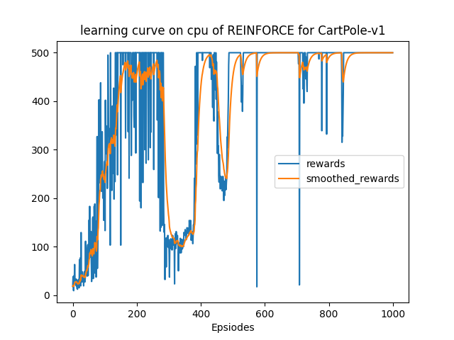
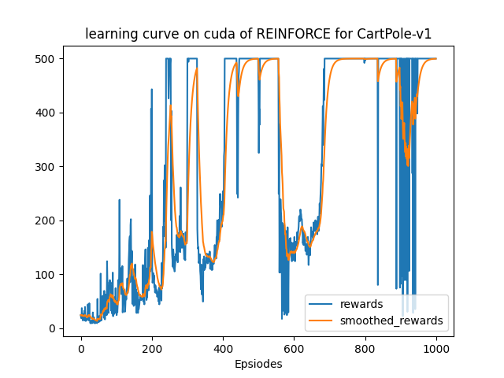
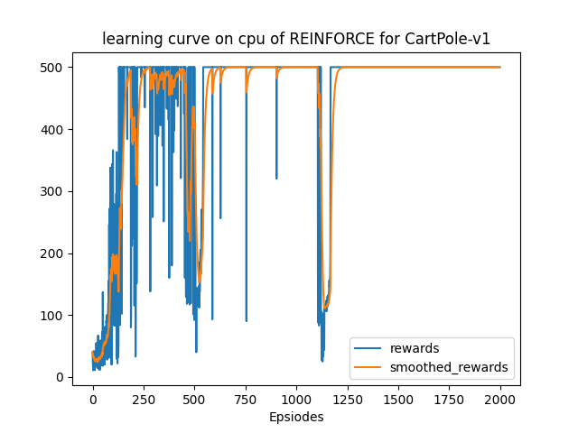
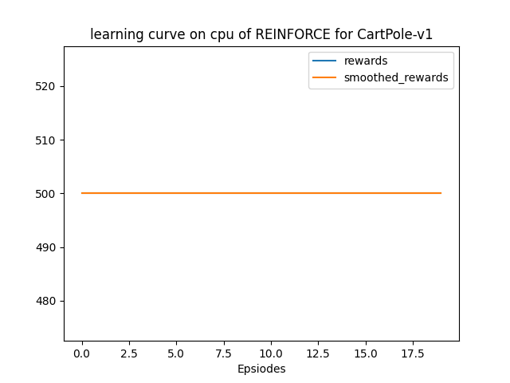

该部分使用`gym`库中的环境`CartPole-v0`和[`CartPole-v1`](https://www.gymlibrary.dev/environments/classic_control/cart_pole/)实践一种基本的Policy Gradient算法REINFORCE，以下仅为笔者个人的实验报告。

## 文件结构

> .  
> ├── main.py  
> ├── output  
> │   ├── models  
> │   └── results  
> ├── README.md  
> ├── reinforce.py  
> └── solver.py  

+ `results`文件夹：为程序的输出结果，包括：在不同训练episode数下，训练及测试的reward曲线，以及挑选一次test录制的可视化的动作。
+ `models`文件夹：储存模型
+ `qlearning.py`：根据REINFORCE算法定义的agent类
+ `solver.py`：train和test流程，即上层的训练模式

## 实验过程

以超参数：

```python
'ep_max_steps': 100000,
'lr': 0.01,
'gamma': 0.99,
```

进行实验，在学习时尝试了两种写法，一是直接利用分类分布根据算法的原始公式进行计算，二是利用利用交叉熵进行计算。这两种方法的数学本质是一样的，但是第二种没有显式的循环，效率更高。具体实现见源码。

对这两种算法计算得出的`loss`进行了对比，挑选某一次输出展示如下：

```python
# 方法一的计算结果
tensor([ 0.7680,  1.1917,  0.5104,  0.7124,  0.5464,  0.5492,  0.4305,  0.3895,
         0.3063,  0.3966,  0.3844,  0.0413,  0.0465, -0.0229, -0.0731, -0.1602,
        -0.3525, -0.3058, -0.6602, -1.2006, -0.2591, -0.3848, -0.6261, -1.0987,
        -0.6409])
# 方法二的计算结果
tensor([ 0.7680,  1.1917,  0.5104,  0.7124,  0.5464,  0.5492,  0.4305,  0.3895,
         0.3063,  0.3966,  0.3844,  0.0413,  0.0465, -0.0229, -0.0731, -0.1602,
        -0.3525, -0.3058, -0.6602, -1.2006, -0.2591, -0.3848, -0.6261, -1.0987,
        -0.6409], grad_fn=<MulBackward0>)
```

可见两种方法的计算结果是相同的。

然而进一步多次实验发现，方法一得到的训练曲线，总体上比方法二的差一些，目前未知原因。下面挑选两个曲线进行对比：

方法一：



方法二：



使用交叉熵的计算方法（即方法二），最终得到的训练及测试曲线如下：





为了更好地展现训练效果，也给出训练500个episode和训练2000个episode的可视化效果进行对比：

500个episode：[可视化视频](https://raw.githubusercontent.com/Stillwtm/RL-Learning/master/REINFORCE/output/results/CartPole-v1/cross_entropy/cartpole-500-episode-0.mp4)

2000个episode：[可视化视频](https://raw.githubusercontent.com/Stillwtm/RL-Learning/master/REINFORCE/output/results/CartPole-v1/cross_entropy/cartpole-2000-episode-0.mp4)

可以看到，虽然两个agent都成功达到了CartPole环境的终止目标，但是2000个episode下的agent明显更加靠近中心，且动作更加稳定。