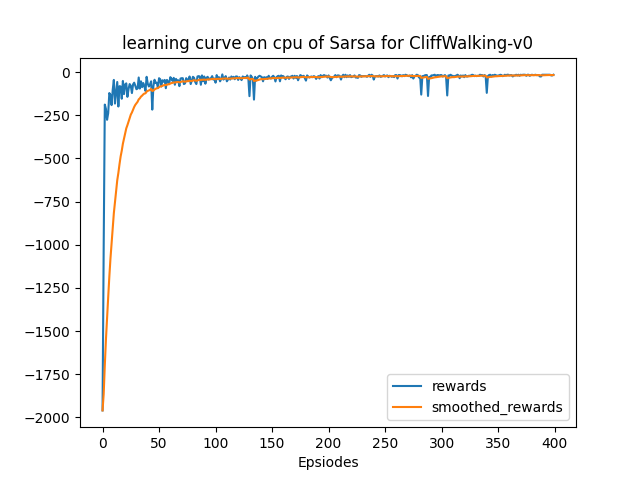
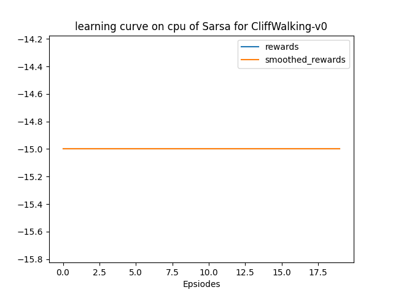

该部分使用`gym`库中的环境[`CliffWalking-v0`](https://www.gymlibrary.dev/environments/toy_text/cliff_walking/)实践RL中的基础算法Sarsa，以下仅为笔者个人的实验报告。

## 文件结构

> .  
> ├── main.py  
> ├── output  
> │   ├── models  
> │   └── results  
> ├── sarsa.py  
> ├── README.md  
> └── solver.py  

+ `results`文件夹：为程序的输出结果，包括：在不同训练episode数下，训练及测试的reward曲线，以及挑选一次test录制的可视化的动作。
+ `models`文件夹：储存模型
+ `sarsa.py`：根据Sarsa算法定义的agent类
+ `solver.py`：train和test流程，即上层的训练模式

## 实验结果

以超参数：

```python
'lr': 0.1,
'gamma': 0.9,
'epsilon_beg': 0.95,
'epsilon_end': 0.01,
'epsilon_decay': 300,
```

一共训练400个episode，每100个episode测试一次。大致情况和Q-Learning相差不大，主要分析一下最终结果的差距。

首先，训练曲线如下：



在Sarsa和Q-Learning的收敛速度上，笔者肉眼没有很明显地看出区别，应该是这个环境比较简单，开始时曲线上升都比较快。

但Sarsa的收敛值确实是比Q-Learning要低的，这可以从最终的test曲线看出来：



直接查看[可视化视频](https://raw.githubusercontent.com/Stillwtm/RL-Learning/master/Sarsa/output/results/cliff-walking-400-episode-0.mp4)可以知道，小人没有选择最短的路径，而是选择离悬崖比较远的路径。

这里可以看出Sarsa的算法特点，由于是on-policy的算法，所以它在探索的时候会倾向于选择更加保守的策略。具体来说，在CliffWalking的环境中，如果小人站在悬崖边上，那么由于Sarsa的更新也是e-greedy地探索，而非直接选取最大值，那么对于小人来说站在悬崖边上就有概率掉下去，那么这个状态函数的值自然就比较低，这导致小人不愿意往悬崖边上走。
