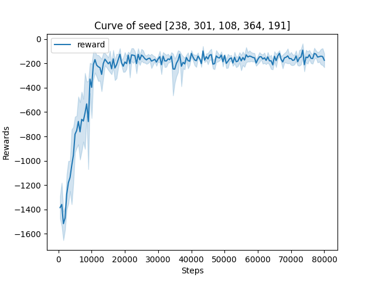

该部分使用`gym`库中的环境[`Pendulum-v1`](https://www.gymlibrary.dev/environments/classic_control/pendulum/), [`HalfCheetah-v4`](https://www.gymlibrary.dev/environments/mujoco/half_cheetah/)实践TD3算法，以下仅为笔者个人的实验报告。

## 文件结构

> .  
> ├── td3.py  
> ├── main.py  
> ├── output  
> │   ├── models  
> │   └── results  
> ├── plot.py  
> ├── train.py  
> └── utils.py

+ `results`文件夹：训练过程数据，以`.pkl`储存；训练曲线图片
+ `models`文件夹：储存模型
+ `td3.py`：根据DDPG算法定义的智能体类
+ `train.py`：train和test流程，上层的训练模式
+ `main.py`：超参数设置，调用整体训练流程
+ `plot.py`：绘图相关功能，可以单独运行利用数据绘图
+ `utils.py`：数据记录、文件夹创建等杂项功能

## 实验结果

在[Pendulum-v1](https://www.gymlibrary.dev/environments/classic_control/pendulum/)环境中以超参数：

```python
'--ep_max_steps'=int(1e4),
'--max_train_steps'=int(8e4),
'--eval_every'=500,
'--buffer_capacity'=int(1e6),
'--hidden_dim'=256,
'--gamma'=0.99,
'--tau'=0.005,
'--noise_sigma'=0.1,
'--policy_noise'=0.2,
'--noise_clip'=0.5,
'--policy_freq'=2,
'--actor_lr'=3e-4,
'--critic_lr'=3e-4,
'--batch_size'=256,
'--start_size'=1024,
```

训练8e4个step，得到训练曲线如下：



可见收敛得很快很稳。事实上，如果直接观察训练数据可以看出，收敛值实际上比PPO算法要高，大约在-150往上，而个人实现的PPO在-200偏下。

在[HalfCheetah-v4](https://www.gymlibrary.dev/environments/mujoco/half_cheetah/)中以超参数：

```python
'--ep_max_steps'=int(1e6),
'--max_train_steps'=int(1e6),
'--eval_every'=int(5e3),
'--buffer_capacity'=int(1e6),
'--hidden_dim'=256,
'--gamma'=0.99,
'--tau'=0.005,
'--noise_sigma'=0.1,
'--policy_noise'=0.2,
'--noise_clip'=0.5,
'--policy_freq'=2,
'--actor_lr'=3e-4,
'--critic_lr'=3e-4,
'--batch_size'=256,
'--start_size'=int(25e3),
```

训练1e6个step，得到训练曲线如下：

![figure_[210]](./output/results/TD3_HalfCheetah-v4_20221021-163641/figure_[210].png)

由于笔者的小笔记本跑得太慢，所以只有一条曲线:crying_cat_face:

但是根据这条曲线看，对比[原论文](https://arxiv.org/pdf/1802.09477.pdf)中的结果，应该复现还是比较成功的。

## 一些细节问题

注意train.py中line25处

```python
# 正确写法
next_state, reward, terminated, truncated, _ = env.step(action)
agent.buffer.push(state, action, reward, next_state, terminated)

# 错误写法
next_state, reward, terminated, truncated, _ = env.step(action)
agent.buffer.push(state, action, reward, next_state, terminated or truncated)  # 这里不能有这个or
```

原始论文的作者使用的gym版本较低，`env.step()`的API还没有区分`terminate`和`truncate`，具体来说，前者是指一局游戏到达终点，后面不再有新的状态了；后者则是指这局游戏的step数达到上限，所以强制truncate掉，但游戏本身还可以继续进行。

论文作者的实现中手动区分了这两种状况，而这里笔者直接利用新版本`gym`的API进行区分。

这两者具体的影响是在计算时序差分的目标时使用的公式实际上是
$$
y=\begin{cases}reward+\gamma Q(s, a), &otherwise\\reward, & terminate\ step\end{cases}
$$
如果将truncate的情况也认为是游戏的终点，计算就会不太对，在Pendulum-v1中实验情况如下：

正确写法下：

![figure_[642, 239, 70, 926, 516]](./output/results/TD3_Pendulum-v1_20221021-155412/figure_[642, 239, 70, 926, 516].png)

错误写法下：

![figure_[642, 239, 70, 926, 516]](./output/results/TD3_Pendulum-v1_20221021-161907/figure_[642, 239, 70, 926, 516].png)

可以看到，错误写法虽然也可以学习，但是明显收敛速度慢很多。

## 参考

论文原作者的实现https://github.com/sfujim/TD3

非常简洁清晰！个人觉得对于初学者来说是很好的了解强化学习整个训练、测试流程的模板，比起openai-baseline之类相对复杂的实现可读性高很多，强烈推荐。
